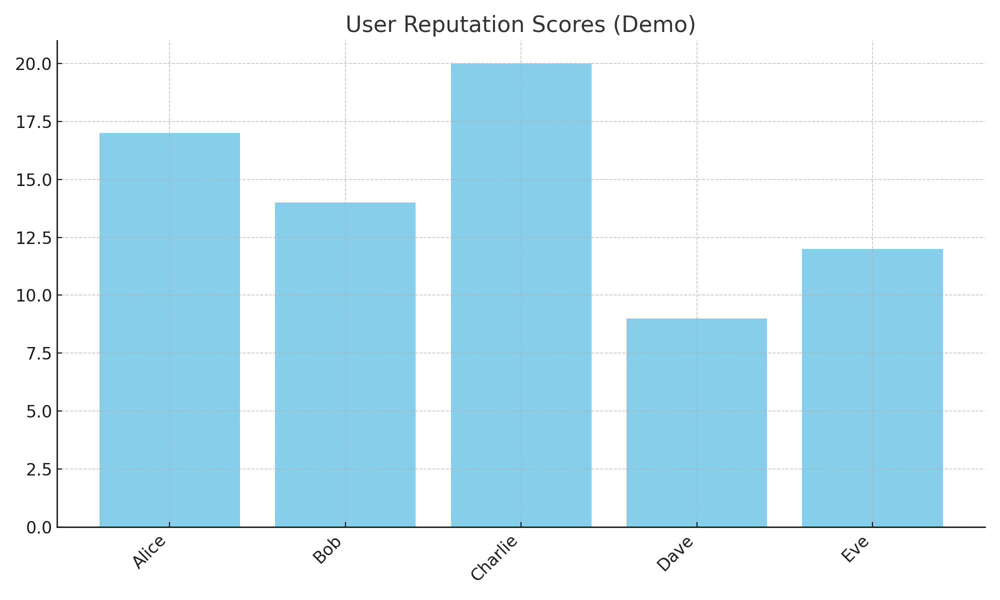

# Decentralized Reputation System (DRS)

This project demonstrates a simple blockchain-based reputation tracking system. Users perform actions (post, vote, comment), which are stored on a blockchain. Reputation scores are computed dynamically.

## Features
- Simple blockchain for actions
- Reputation computation per user
- JSON export & charts
- Automated testing and CI

## Quick Start

### 1. Clone Repo
```bash
git clone <repo_url>
cd decentralized_reputation
```

### 2. Install Dependencies
```bash
pip install -r requirements.txt
```

### 3. Run Demo
```bash
bash run_demo.sh
```

Outputs:
- `outputs/reputation.json` → JSON scores
- `charts/reputation.png` → Reputation chart

### 4. Run Tests
```bash
pytest -v
```

### 5. GitHub Actions
- Automatically runs linting, tests, and demo on push/pull request

---

### Example Output

**Chart Example:**


**JSON Example:**
```json
{
  "Alice": 17,
  "Bob": 14,
  "Charlie": 20,
  "Dave": 9,
  "Eve": 12
}
```
